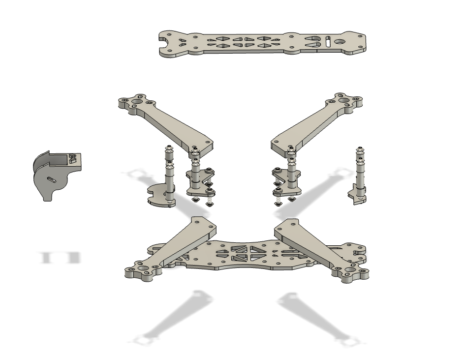
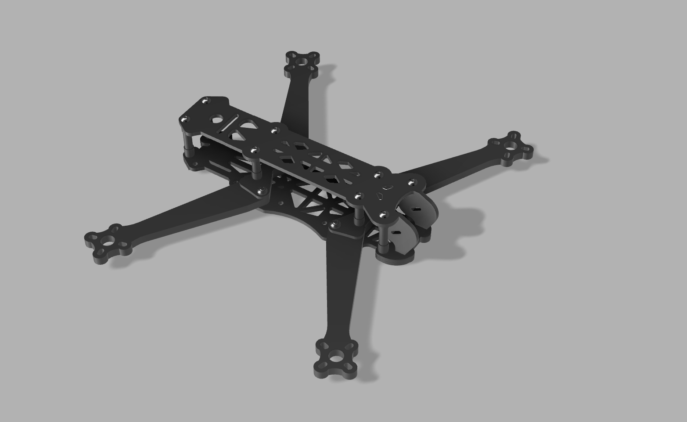
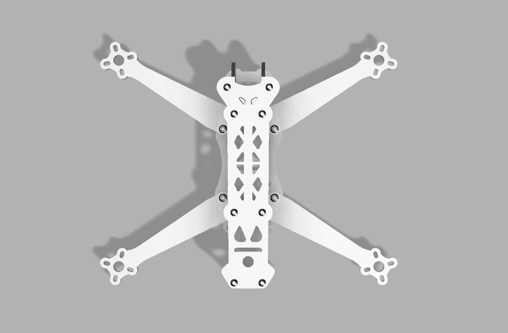
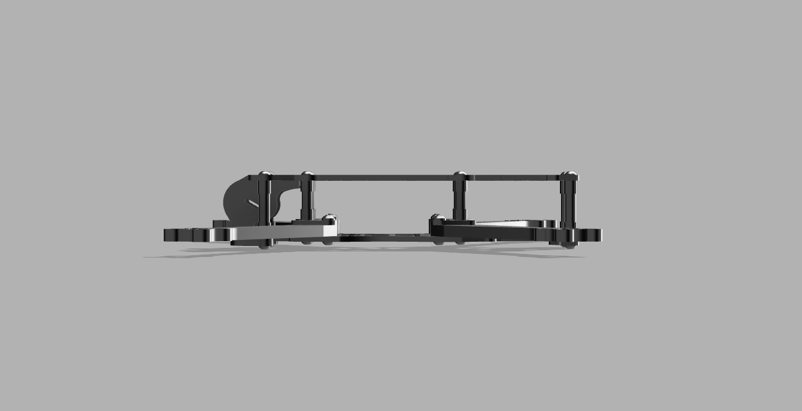

# 5-Inch FPV Drone Frame

A custom-designed 5-inch freestyle FPV drone frame built in Autodesk Fusion 360, focused on durability, modularity, and real-world flight protection.

## Design Highlights

- **Widened Base Plate:** Extended dimensions offer enhanced coverage for the flight controller (FC) and electronic speed controller (ESC), helping to absorb impacts and protect internal electronics during crashes.
- **Reinforced Camera Mount:** Features a deeper, enclosed mounting area that shields the camera lens from direct collisions without obstructing the field of view.
- **Modular Arm Layout:** Easy-to-replace arms for field repairs, with solid mounting points to maintain rigidity.
- **Optimized for Freestyle:** Geometry tuned for dynamic flight, minimizing frame flex while balancing agility and durability.

## Tools & Workflow

- **CAD Software:** Autodesk Fusion 360
- **Simulation Tools:** Static load testing (optional in future iteration)
- **Flight Stack Compatibility:** Betaflight-ready stack spacing and cable clearance
- **Manufacturing Ready:** Designed for CNC carbon fiber or 3D printed prototyping

## Files Included

- `drone_frame_v1.f3z` – Fusion 360 source file
- `.step` and `.stl` – For CNC or 3D printing
- `/renders/` – Design previews and exploded views

## Future Plans

- Print PLA/ABS prototype for dimensional validation
- Finalize carbon fiber CNC version
- Real-world testing and PID tuning for crash performance
- Add optional GoPro mount bracket and antenna guard

----

## Rendered Previews

### Exploded View
Shows modular structure including arms, standoffs, camera mount, and plates.

### Assembled Isometric View
Complete build showing frame shape, symmetry, and part alignment.

### Top-Down View
Highlights drone arm layout, mounting hole spacing, and top plate cutouts.

### Side Profile View
Demonstrates standoff height and FC/ESC clearance from side angle.

